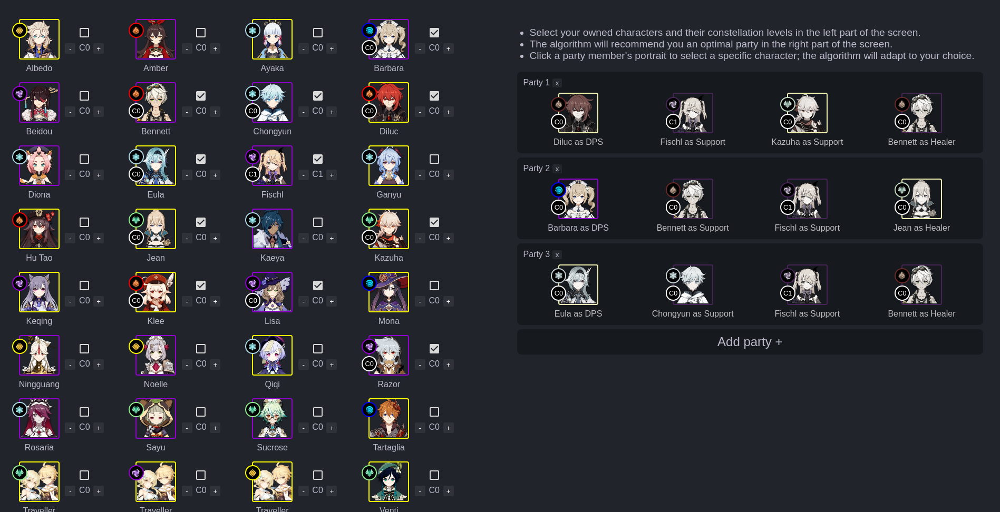

# Party Builder for Genshin Impact v2

This is an AI-assisted team creation tool for Genshin Impact. It helps beginners to assemble well-rounded teams no matter how many or which characters they have.

It takes into account which characters you have, their constellation levels, elemental resonances, which roles they fill the best, their weapon types, possible elemental reactions, how good they are considered in the community, etc.

You can try it out by clicking the link -> [https://genshin.hemlo.cc/partybuilder](https://genshin.hemlo.cc/partybuilder)

## Roadmap
- [x] Redesign the app for step-by-step workflow
- [x] Add an option to import the list of characters
- [x] Rewrite the logic of the automatic suggestion algorithm to take in account roles, elemental reactions, weapon types, etc.
- [ ] Provide an easy way to report algorithm balancing issues
- [ ] Add team configuration options
- [ ] Display insights about the team
- [ ] Improve UI and release it as a Vue.js UI library
- [ ] Make the app a PWA
- [ ] Create a tier list page

## Contributing
All pull requests are welcome. For major changes, please open an issue first to discuss what you would like to change.

### Running the app locally
Prerequisites:
- Node.js
- pnpm (or npm, Yarn, etc.)

Steps:
1. Clone this repository
2. Install the dependencies by running `pnpm i` inside the local copy of the repo
3. Create a copy of `.env.template` file and name it `.env`
4. Run the application by executing `pnpm dev`
5. Access the application in your browser of choice under [http://localhost:8080](http://localhost:8080)

## By the way
This is a fan-created application that is not affiliated with or endorsed by miHoYo.
