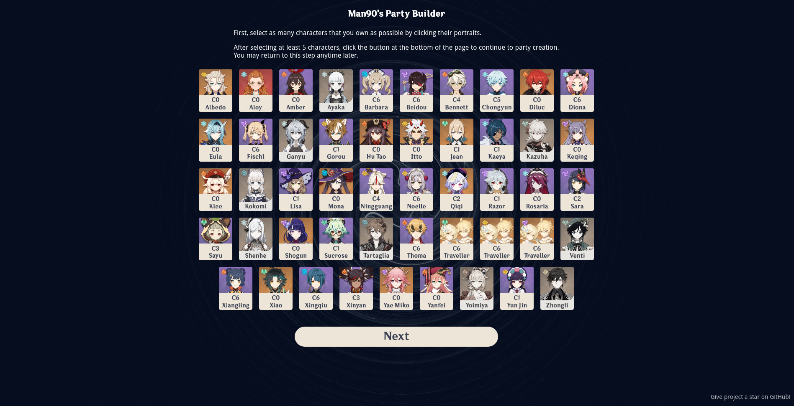

# Party Builder for Genshin Impact

This is an AI-assisted team creation tool for Genshin Impact. It helps beginners to assemble well-rounded teams no matter how many or which characters they have.

It takes into account which characters you have, their constellation levels, elemental resonances, which roles they fill the best and how good they are considered in the community.

But enough with the trivia. Here's the link: [https://genshin.hemlo.cc/partybuilder](https://genshin.hemlo.cc/partybuilder)

## Contributing
All pull requests are welcome. For major changes, please open an issue first to discuss what you would like to change.

Running the app locally is straightforward and matches how it's done with the majority of Vue.js apps.
1. Clone this repository
2. Install the dependencies by running `yarn install` or `npm i` in the cloned directory
3. Create a copy of `.env.template` and name it `.env`
4. Run the application by executing `yarn serve` or `npm run serve`
5. Access the application in your browser of choice under [http://localhost:8080](http://localhost:8080)

## By the way
This is a fan-created application that is not affiliated with or endorsed by miHoYo.
